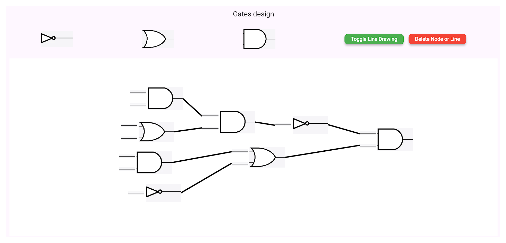

# Logic Gates Designer Web App

## Description

An interactive web application for designing and visualizing logic circuits. Users can drag and drop gates, connect nodes, and dynamically visualize circuit designs in a responsive canvas.

## Features

- Drag-and-drop logic gates (AND, OR, NOT).
- Dynamic line drawing for node connections.
- Customizable node configurations for each gate.
- Real-time gate movement with dynamic line updates.

## Website

The project is hosted as a web application. Open it in any modern web browser for a seamless experience.

## Tech Stack

- **Flutter**: Frontend framework for building web applications.
- **Dart**: Programming language used with Flutter.
- **CustomPainter**: For rendering dynamic visual connections on the canvas.

## To run

`flutter run -d chrome or flutter run`
